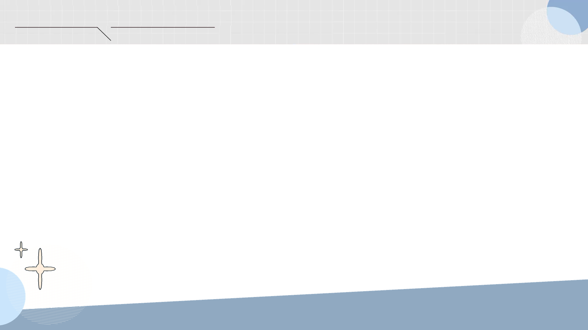

# Taiwan Hearing Video Template

供 Codex 使用的 1920 × 1080 台灣立法院質詢影片套版 Skill。

此套版依人工剪輯參考影片整理，包含上方資訊欄、由左下往右上斜的淺藍字幕帶、左下幾何圖案，以及人物標籤、字幕與重點字卡的配置規則。



## 套版特色

- 1920 × 1080、16:9 完整畫布
- 上方灰色格線資訊欄
- 右上圓形與斜線裝飾
- 左低右高的淺藍字幕帶
- 左下圓形、細條紋與星芒圖案
- 下方不透明色塊可遮住落在該區域的原始時間碼
- 日期、標題、人物姓名與字幕保持動態，不寫死在 PNG 裡

## 素材

```text
assets/
├── header.png
├── subtitle-band.png
└── full-overlay.png
```

| 檔案 | 用途 |
|---|---|
| `header.png` | 上方資訊欄與右上裝飾 |
| `subtitle-band.png` | 下方斜切字幕帶與左下裝飾 |
| `full-overlay.png` | 前兩張素材的合併版 |

三張素材均為 **1920 × 1080 RGBA PNG**。使用時固定放在畫面座標 `(0, 0)`，不裁切、不縮放。

可以使用 `full-overlay.png`，或分別使用 `header.png` 加 `subtitle-band.png`；不可同時重複疊加合併版與分層版。

## 安裝

Skill 的標準結構與運作方式可參考 [OpenAI Skills 官方文件](https://developers.openai.com/api/docs/guides/tools-skills)。

### Windows PowerShell

```powershell
New-Item -ItemType Directory -Force "$env:USERPROFILE\.codex\skills" | Out-Null
git clone https://github.com/lrs0614tw/taiwan-hearing-video-template.git "$env:USERPROFILE\.codex\skills\taiwan-hearing-video-template"
```

### macOS／Linux

```bash
mkdir -p ~/.codex/skills
git clone https://github.com/lrs0614tw/taiwan-hearing-video-template.git ~/.codex/skills/taiwan-hearing-video-template
```

也可以在 GitHub 選擇 **Code → Download ZIP**，解壓後將完整資料夾放入：

- Windows：`%USERPROFILE%\.codex\skills\taiwan-hearing-video-template\`
- macOS／Linux：`~/.codex/skills/taiwan-hearing-video-template/`

安裝後重新啟動 Codex，或建立新的 Codex 工作，讓系統重新載入 Skill。

## 使用範例

```text
請使用 taiwan-hearing-video-template，把這支立法院質詢影片套用統一版型。
沿用原片比例，遮住原始時間碼，人物標籤只在人物入鏡時顯示。
```

若同時安裝剪輯流程 Skill：

```text
請使用 edit-youthful-social-video 和 taiwan-hearing-video-template，
先整理完整問答與逐字稿，再套用立法院質詢模板。
```

搭配的剪輯流程 Skill：

[edit-youthful-social-video](https://github.com/lrs0614tw/edit-youthful-social-video)

## 規格

| 項目 | 規格 |
|---|---|
| 畫布 | 1920 × 1080 px，16:9 |
| 素材格式 | PNG-24、RGBA、透明背景 |
| 上方資訊欄 | `Y=0–145` |
| 字幕帶左端 | 約 `Y=1017` |
| 字幕帶右端 | 約 `Y=915` |
| 字幕帶方向 | 左低右高 |
| 左下裝飾範圍 | 約 `X=0–305`、`Y=787–1080` |
| 素材定位 | 完整畫布固定在 `(0, 0)` |

## 圖層順序

由下至上：

1. 已剪輯的原始影片
2. `full-overlay.png`，或 `header.png` 加 `subtitle-band.png`
3. 日期與委員會名稱
4. 人物姓名與職稱
5. 逐字字幕
6. 重點字卡

日期、委員會名稱、人物姓名、逐字字幕及重點字卡都屬於動態內容，不應寫入固定 PNG。

## 字幕帶方向

字幕帶上緣必須維持：

- 左側較低：約 `Y=1017`
- 右側較高：約 `Y=915`
- 視覺方向為左下往右上

不可改成水平色塊，也不可反轉成左高右低。

## 文字參考

固定 PNG 不包含文字；以下文字應由剪輯端動態加入：

- 上方日期及委員會名稱
- 人物姓名與職稱
- 一般逐字字幕
- 語氣加重時出現的重點字卡

目前參考配置：

| 元素 | 參考設定 |
|---|---|
| 上方標題 | 深色粗體中文無襯線，約 58 px |
| 一般字幕 | 淡黃色，深藍陰影，約 90 px |
| 左側人物標籤 | 深藍色直排 |
| 右側人物標籤 | 白色直排、深色描邊 |
| 重點字卡 | 畫面中央附近，淡黃色、深藍描邊 |

## 驗收重點

- 三張 PNG 都是 1920 × 1080，中央區域透明
- 字幕帶維持左低右高
- 下方藍色區域完全不透明
- 左下的圓形、條紋與星芒圖案完整
- 固定素材內沒有任何會隨影片更換的文字
- 套到 1920 × 1080 影片後不需要縮放
- 原始時間碼若位於字幕帶之外，另行裁切或覆蓋
- 人物標籤只在身分確認且人物實際入鏡時顯示

## 專案結構

```text
.
├── README.md
├── SKILL.md
└── assets/
    ├── header.png
    ├── subtitle-band.png
    └── full-overlay.png
```

## 常見問題

### 套版出現，但幾何圖案遺失

確認複製的是整個 repository，包括 `assets/`，而不是只複製 `SKILL.md`。

### 字幕帶方向相反

正確方向是左低右高。請直接使用 `assets/subtitle-band.png` 或 `assets/full-overlay.png`，不要重新畫成反方向。

### 原始時間碼仍然可見

字幕帶只能遮住位於藍色色塊後方的時間碼。如果來源影片的時間碼較高，仍須依實際位置另外裁切或覆蓋。

## 安全提醒

公開或分享影片前，請確認來源影片、人物資訊、字幕及視覺素材的使用權。安裝任何第三方 Skill 前，也應先閱讀其中的 `SKILL.md` 與相關檔案。
